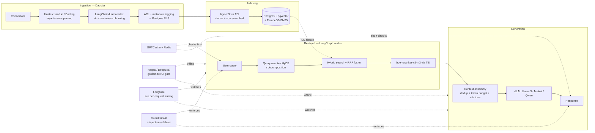

# Industry-Grade RAG — System Design (Open-Source Stack)

Eight production layers, a specific open-source tool for each, and the build order that gets you there. This revision folds in the gaps found when comparing against the original open-source plan: reranking, query rewriting, ACL enforcement, prompt-injection defense on retrieved content, caching, live tracing, and async/multi-tenant ingestion.

**Consistency choices made throughout:**
- **BAAI's BGE family** for both embedding (`bge-m3`) and reranking (`bge-reranker-v2-m3`) — one model family, one serving path, dense+sparse output from a single embed call.
- **Hugging Face TEI** (Text Embeddings Inference) serves both the embedder and the reranker — one serving stack instead of two.
- **vLLM** for production generation serving. Ollama stays a local-dev convenience, not part of the prod path — different concurrency/throughput profile, don't let dev and prod diverge silently.
- **Postgres** carries data, vectors, keyword search, *and* access control (via RLS) — one system of record instead of a separate permissions store.
- **Redis** backs both the semantic cache and the event queue — one piece of infra, two jobs.
- **LangGraph** owns every orchestration step (query rewrite, retrieval, rerank, context assembly, generation) as explicit nodes — the graph *is* the pipeline diagram below, not a wrapper around it.

**Deliberate exception to the self-hosted stack:** picture/chart extraction during ingestion (Layer 1) calls the **Gemini API** (hosted, not self-hosted) for the minority of pictures flagged by a cheap local triage step. See `Documents/EXTRACTION_APPROACH.md` for the full rationale — in short, OCR structurally cannot read symbolic/iconographic content (icons, arrows used in place of numbers), and validated testing showed no self-hosted OCR or layout engine closes that gap. This is a scoped, conscious deviation for one narrow sub-step, not a reversal of the self-hosted default elsewhere in the stack.

## 1. The pipeline

## 2. The eight layers, with tools and the gap fixed in each

### 1 — Ingestion & preprocessing
| | |
|---|---|
| Parsing | **Unstructured.io** or **Docling** |
| Chunking | **LangChain/LlamaIndex** structure-aware splitters |
| Orchestration | **Dagster** — schedules connector DAGs, handles incremental runs and backfills instead of a cron script |
| ACL/metadata | Connector pulls source-system permissions (SharePoint groups, Confluence space perms, S3 bucket policy) into a `Postgres` metadata table alongside each chunk — *not* left implicit |

*Gap fixed: ACL is now an explicit extraction step at ingestion, not something assumed to exist at query time.*

### 2 — Embedding & indexing
| | |
|---|---|
| Embedding model | **BAAI/bge-m3**, self-hosted via **Hugging Face TEI** — outputs dense + sparse vectors from one call |
| Store | **Postgres + pgvector** (HNSW index) + **ParadeDB (pg_search)** for BM25 |
| Access control | **Postgres Row-Level Security** on the chunks table, keyed on the ACL metadata from ingestion — permission filtering happens *inside* the SQL query, not as a post-filter in application code |
| Scale-out alternative | **Qdrant** or **Milvus**, collection-per-tenant, when a single Postgres instance stops being enough |

*Gap fixed: embedding model is now specified and paired with its reranker; ACL is enforced at the database layer via RLS instead of assumed.*

### 3 — Retrieval
| | |
|---|---|
| Query transform | **LangGraph node**: rewrite / HyDE / decomposition using the same vLLM-served model, run *before* search |
| Hybrid fusion | pgvector (dense) + ParadeDB (BM25), combined with reciprocal rank fusion |
| Reranking | **BAAI/bge-reranker-v2-m3** via TEI, cross-encoder rerank on the fused top-k |

*Gap fixed: this whole layer was the biggest hole in the original plan — hybrid search alone with no query transform and no reranker. Both are now explicit nodes.*

### 4 — Generation & orchestration
| | |
|---|---|
| Context assembly | **LangGraph node**: dedup near-identical chunks, fit token budget (counted via `tiktoken`/HF tokenizers), attach source citations |
| Prompt structure | Retrieved chunks wrapped in explicit delimiters and labeled as untrusted data in the system prompt — the model is instructed to never treat delimited content as instructions |
| Generation serving | **vLLM** serving Llama 3 / Mistral / Qwen |
| Agentic routing | **LangGraph**: router node decides RAG vs. tool call vs. direct answer |

*Gap fixed: context assembly is now a real pipeline stage, and the prompt template explicitly defends against instructions smuggled inside retrieved documents — a different problem than Guardrails AI's input/output checks.*

### 5 — Caching
| | |
|---|---|
| Semantic cache | **GPTCache** backed by **Redis** — embeds the incoming query, checks for a near-duplicate answer before hitting retrieval or generation |

*Gap fixed: not present in the original plan at all. Cuts latency and generation cost on repeat/near-repeat queries.*

### 6 — Evaluation & observability
| | |
|---|---|
| Offline eval | **Ragas** / **DeepEval** — faithfulness, answer relevance, context precision against a versioned golden Q&A set, run as a CI gate on every pipeline change |
| Live tracing | **Langfuse** (self-hosted) — captures every production request's query → rewritten query → retrieved chunks → reranked set → prompt → response, for debugging and for mining new golden-set examples from real traffic |

*Gap fixed: eval and observability were conflated in the original plan. Ragas/DeepEval answer "did quality regress" in CI; Langfuse answers "what actually happened for this user's request in prod" — different cadence, different tool, both needed.*

### 7 — Guardrails & security
| | |
|---|---|
| Input/output policy | **Guardrails AI** — PII detection, toxicity, schema validation on both the user's query and the model's response |
| Prompt injection from retrieved content | Guardrails AI's injection validator on the input path, *plus* the delimiter/instruction-hierarchy pattern in the prompt template (see Layer 4) — Guardrails alone doesn't catch instructions hiding inside a retrieved chunk |
| Access control | Enforced end-to-end via Postgres RLS (Layer 2), not just filtered in the UI |

*Gap fixed: prompt injection via retrieved documents is called out as distinct from generic input/output guardrails, and ACL is now enforced at the data layer, not the application layer.*

### 8 — Infra & scaling
| | |
|---|---|
| Batch/incremental orchestration | **Dagster** |
| Event-driven ingestion | **Redis Streams / Celery** — webhook or CDC-triggered updates queue here instead of waiting for the next scheduled Dagster run |
| Reindexing | Blue-green swap: build the new embedding/index version in a parallel table (Postgres) or collection (Qdrant, via alias swap) and cut over atomically — never rebuild in place |
| Multi-tenancy | Postgres RLS + `tenant_id` at moderate scale; per-tenant collections in Qdrant/Milvus at large scale |
| Red-teaming | **Giskard** — automated adversarial scanning for hallucination, bias, and information leakage before each major release |

*Gap fixed: ingestion had no async/event-driven path and no multi-tenancy story in the original plan; both are now explicit. Red-teaming (Giskard) was already a strong addition in the original plan and is kept as-is.*

## 3. Full stack summary

| Layer | Tool(s) |
|---|---|
| Ingestion orchestration | Dagster |
| Parsing | Unstructured.io / Docling |
| Chunking | LangChain / LlamaIndex |
| Embedding + reranking | BAAI bge-m3 + bge-reranker-v2-m3, served via Hugging Face TEI |
| Store | Postgres + pgvector + ParadeDB (pg_search); Qdrant/Milvus at scale |
| Access control | Postgres Row-Level Security |
| Orchestration/agentic logic | LangGraph |
| Generation serving | vLLM (Ollama for local dev only) |
| Caching | GPTCache + Redis |
| Event-driven ingestion | Redis Streams / Celery |
| Offline eval | Ragas / DeepEval |
| Live tracing | Langfuse |
| Guardrails | Guardrails AI |
| Red-teaming | Giskard |

## 4. Build order

| Phase | Focus | What's added |
|---|---|---|
| **0** | Naive RAG loop | Dagster batch job (one connector) → Unstructured parse → chunk → bge-m3 embed via TEI → pgvector store → dense-only search → vLLM generate. No rerank, no eval. Baseline only. |
| **1** | Retrieval quality | ParadeDB BM25 + RRF fusion, bge-reranker-v2-m3, LangGraph query-rewrite node, structure-aware chunking, metadata filters. Highest quality-per-effort phase. |
| **2** | Evaluation harness | Ragas/DeepEval golden set + CI regression gate. Stand up Langfuse to start capturing real traces — you'll mine the golden set from these later. |
| **3** | Production hardening | Postgres RLS for ACL, Guardrails AI (input/output + injection validator) with delimited-context prompting, GPTCache semantic cache. |
| **4** | Scale & ops | Redis Streams/Celery event-driven ingestion, blue-green reindexing, multi-tenant isolation, Giskard red-team pass before release, autoscaled vLLM replicas. |

> Build eval (Phase 2) before hardening (Phase 3) — without it, every guardrail or prompt change is a guess about whether it helped.

## 5. Scale-dependent choices

| Component | Small (<1M chunks) | Large (10M+ chunks, multi-tenant) |
|---|---|---|
| Store | Single Postgres + pgvector + ParadeDB | Qdrant/Milvus, sharded per tenant |
| Ingestion | Dagster on a schedule | Dagster + Redis Streams event-driven, CDC from source systems |
| Reranking | TEI on a single GPU | TEI replicas behind a load balancer, batched |
| Generation | Single vLLM instance | Autoscaled vLLM pool + tiered routing (small classifier decides RAG vs. tool vs. direct) |
| Multi-tenancy | Postgres RLS + `tenant_id` | Per-tenant Qdrant/Milvus collections |

---

Next concrete step: pick the actual document sources and expected query volume for `Prod_RAG`, and I'll turn Phase 0 into a scaffolded repo.
